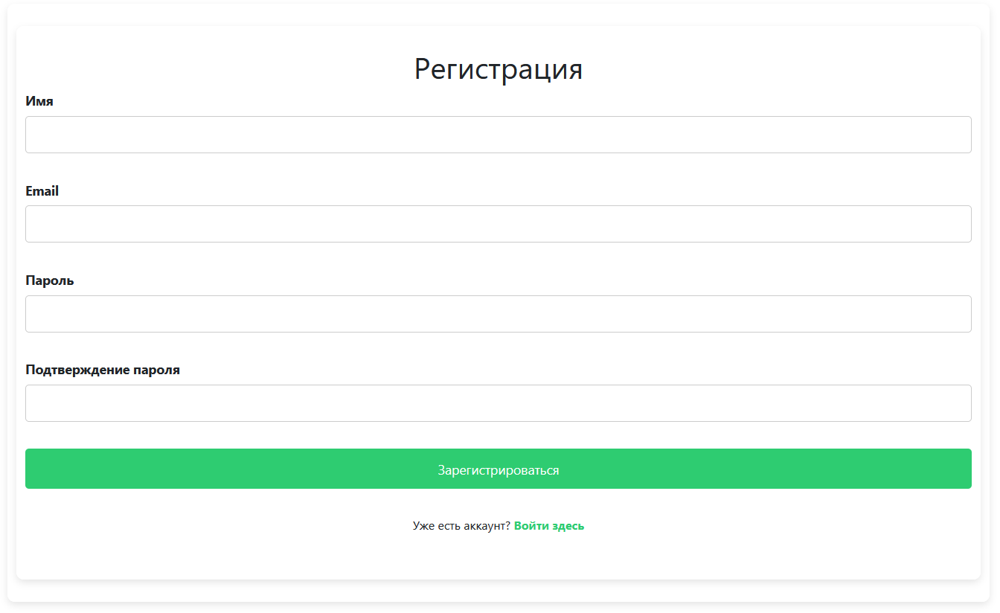
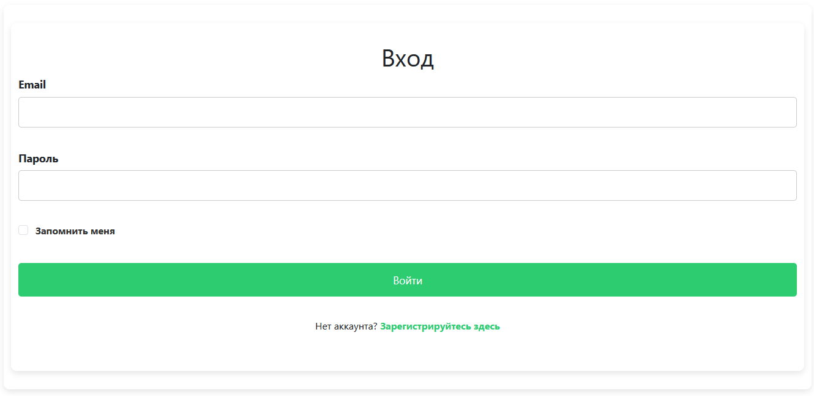
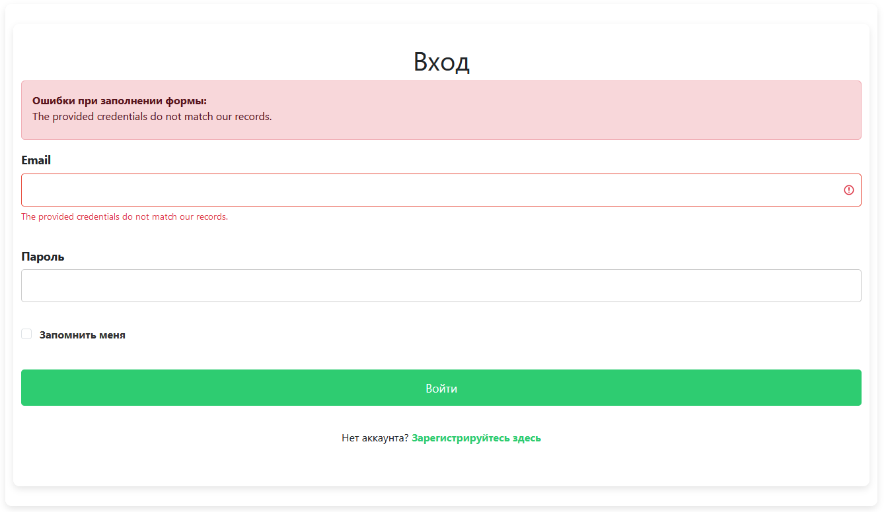
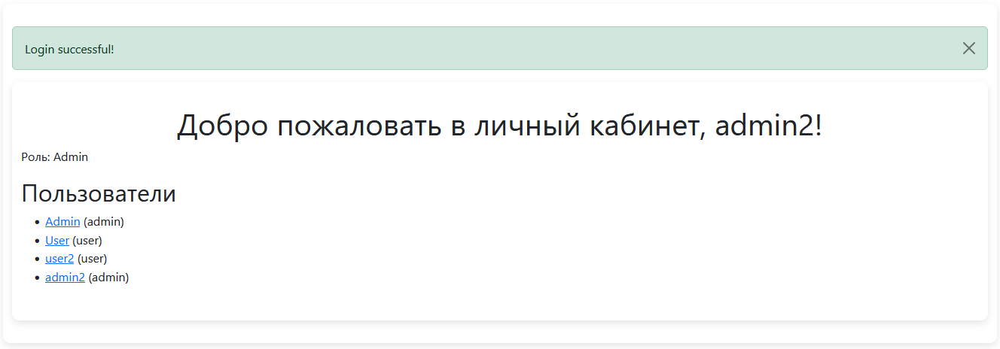
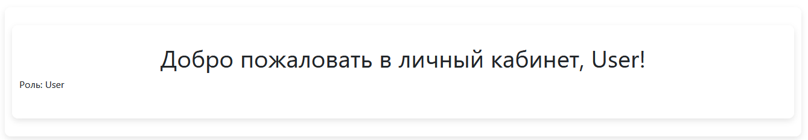
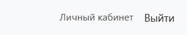

# Лабораторная работа №5. Компоненты безопасности в Laravel

## Цель работы

Познакомиться с основами компонентов безопасности в Laravel, таких как **аутентификация**, **авторизация**, **защита от CSRF**, а также использование встроенных механизмов для управления доступом.

Освоить подходы к безопасной разработке, включая создание защищенных маршрутов и управление ролями пользователей.

## Условие

В данной лабораторной работе вы реализуете основные компоненты безопасности, такие как аутентификация, авторизация, защита маршрутов и базовая работа с ролями. Дополнительно вы настроите механизм сброса пароля и исследуете логирование действий пользователя.

> [!NOTE]
> Вы можете продолжать свою прошлую работу или начать новый проект.

### №1. Подготовка к работе

1. Создайте новый проект Laravel (если не установлен) или продолжите работу с прошлым проектом.
2. Убедитесь, что переменные окружения в `.env` настроены правильно, включая подключение к базе данных.

### №2. Аутентификация пользователей

1. Создайте контроллер `AuthController` для управления аутентификацией пользователей.
2. Добавьте и реализуйте методы для регистрации, входа и выхода пользователя.
   - `register()` для отображения формы регистрации.
   - `storeRegister()` для обработки данных формы регистрации.
   - `login()` для отображения формы входа.
   - `storeLogin()` для обработки данных формы входа.
3. Создайте маршруты для регистрации, входа и выхода пользователя.
4. Обновите представления для форм регистрации и входа.
5. Создайте отдельный класс `Request` для валидации данных при регистрации или входе, либо добавьте валидацию непосредственно в контроллер.
6. Проверьте, что регистрация и вход пользователя работают корректно.

### №3. Аутентификация пользователей с помощью готовых компонентов

> [!NOTE]
> Данный шаг является дополнительным и может быть выполнен после основной части работы.

1. Установите библиотеку **Laravel Breeze** (или Fortify, Jetstream) для быстрой настройки аутентификации.
    ```bash
    php artisan breeze:install
    npm install && npm run dev
    php artisan migrate
    ```
2. Следуйте инструкциям по установке и настройке пакета.
3. Проверьте, что маршруты `/register`, `/login`, `/logout` работают корректно.

### №4. Авторизация пользователей

1. Реализуйте страницу "Личный кабинет", доступ к которой имеют только авторизованные пользователи.
2. Настройте проверку доступа к данной странице, добавив middleware `auth` в маршрут или реализовав проверку в контроллере.
3. Обновите представление страницы "Личный кабинет", чтобы отображать информацию, доступную исключительно авторизованным пользователям.

### №5. Роли пользователей

1. Добавьте систему ролей: **Администратор** и **Пользователь**.
2. Настройте поведение для каждой роли:
   1. **Администратор**: имеет возможность просматривать личные кабинеты всех пользователей.
   2. **Пользователь**: может просматривать исключительно свой личный кабинет.
3. Реализуйте проверки ролей с использованием метода `can`, `Gate`, или `middleware`, чтобы обеспечить корректное распределение прав доступа.

### №6. Выход и защита от CSRF

1. Добавьте кнопку выхода пользователя на страницу.
2. Обеспечьте защиту от CSRF-атак на формах.
3. Проверьте, что выход пользователя работает корректно и безопасно.

## Контрольные вопросы

1. Какие готовые решения для аутентификации предоставляет Laravel?
2. Какие методы аутентификации пользователей вы знаете?
3. Чем отличается аутентификация от авторизации?
4. Как обеспечить защиту от CSRF-атак в Laravel?

## Выполнение лабораторной

### №2. Аутентификация пользователей

```bash
php artisan make:controller AuthController
```
1. Создан контроллер `AuthController` для управления аутентификацией пользователей.
2. Добавьлены методы для регистрации, входа и выхода пользователя.

#### 1.2 Создание маршрутов для аутентификации

**Файл:** `routes/web.php`

```php
<?php

use Illuminate\Support\Facades\Route;
use App\Http\Controllers\AuthController;

// Маршруты аутентификации
Route::get('/register', [AuthController::class, 'register'])->name('register');
Route::post('/register', [AuthController::class, 'storeRegister'])->name('register.post');

Route::get('/login', [AuthController::class, 'login'])->name('login');
Route::post('/login', [AuthController::class, 'storeLogin'])->name('login.post');

Route::post('/logout', [AuthController::class, 'logout'])->name('logout');
```

#### 1.3 Создание представлений для форм регистрации и входа

**Файл:** `resources/views/auth/register.blade.php`

```blade
@vite('resources/css/app.css')
@extends('layouts.app')

@section('content')
<div class="container">
    <h1>Вход</h1>

    @if ($errors->any())
        <div class="alert alert-danger">
            <strong>Ошибки при заполнении формы:</strong>
            <ul>
                @foreach ($errors->all() as $error)
                    <li>{{ $error }}</li>
                @endforeach
            </ul>
        </div>
    @endif

    <form action="{{ route('login.post') }}" method="POST">
        @csrf

        <div class="mb-3">
            <label for="email" class="form-label">Email</label>
            <input 
                type="email" 
                name="email" 
                class="form-control @error('email') is-invalid @enderror" 
                id="email" 
                value="{{ old('email') }}" 
                required
            >
            @error('email')
                <div class="invalid-feedback">
                    {{ $message }}
                </div>
            @enderror
        </div>

        <div class="mb-3">
            <label for="password" class="form-label">Пароль</label>
            <input 
                type="password" 
                name="password" 
                class="form-control @error('password') is-invalid @enderror" 
                id="password" 
                required
            >
            @error('password')
                <div class="invalid-feedback">
                    {{ $message }}
                </div>
            @enderror
        </div>

        <!-- Remember me -->
        <div class="mb-3 form-check">
            <input type="checkbox" name="remember" class="form-check-input" id="remember">
            <label class="form-check-label" for="remember">Запомнить меня</label>
        </div>

        <button type="submit" class="btn btn-primary">Войти</button>

        <p class="mt-3">
            Нет аккаунта? <a href="{{ route('register') }}">Зарегистрируйтесь здесь</a>
        </p>
    </form>
</div>
@endsection
```

**Файл:** `resources/views/auth/login.blade.php`

```blade
@extends('layouts.app')

@section('content')
<div class="container">
    <h1>Вход</h1>

    @if ($errors->any())
        <div class="alert alert-danger">
            <strong>Ошибки при заполнении формы:</strong>
            <ul>
                @foreach ($errors->all() as $error)
                    <li>{{ $error }}</li>
                @endforeach
            </ul>
        </div>
    @endif

    <form action="{{ route('login.post') }}" method="POST">
        @csrf

        <!-- Поле для email -->
        <div class="mb-3">
            <label for="email" class="form-label">Email</label>
            <input 
                type="email" 
                name="email" 
                class="form-control @error('email') is-invalid @enderror" 
                id="email" 
                value="{{ old('email') }}" 
                required
            >
            @error('email')
                <div class="invalid-feedback">
                    {{ $message }}
                </div>
            @enderror
        </div>

        <!-- Поле для пароля -->
        <div class="mb-3">
            <label for="password" class="form-label">Пароль</label>
            <input 
                type="password" 
                name="password" 
                class="form-control @error('password') is-invalid @enderror" 
                id="password" 
                required
            >
            @error('password')
                <div class="invalid-feedback">
                    {{ $message }}
                </div>
            @enderror
        </div>

        <!-- Чекбокс "Запомнить меня" -->
        <div class="mb-3 form-check">
            <input type="checkbox" name="remember" class="form-check-input" id="remember">
            <label class="form-check-label" for="remember">Запомнить меня</label>
        </div>

        <!-- Кнопка отправки формы -->
        <button type="submit" class="btn btn-primary">Войти</button>

        <p class="mt-3">
            Нет аккаунта? <a href="{{ route('register') }}">Зарегистрируйтесь здесь</a>
        </p>
    </form>
</div>
@endsection
```

#### 1.4 Валидация данных

Созданы классы запросов для валидации данных при регистрации и входе.

**Файл:** `app/Http/Requests/RegisterRequest.php`

```php
<?php

namespace App\Http\Requests;

use Illuminate\Foundation\Http\FormRequest;

class RegisterRequest extends FormRequest
{
    public function authorize()
    {
        return true; // Разрешаем всем
    }

    public function rules()
    {
        return [
            'name' => 'required|string|max:255',
            'email' => 'required|email|unique:users,email',
            'password' => 'required|min:6|confirmed', // 'confirmed' проверяет наличие поля 'password_confirmation'
        ];
    }

    public function messages()
    {
        return [
            'name.required' => 'Пожалуйста, введите ваше имя.',
            'email.required' => 'Пожалуйста, введите ваш email.',
            'email.email' => 'Введите действительный email адрес.',
            'email.unique' => 'Этот email уже зарегистрирован.',
            'password.required' => 'Пожалуйста, введите пароль.',
            'password.min' => 'Пароль должен содержать не менее 6 символов.',
            'password.confirmed' => 'Пароли не совпадают.',
        ];
    }
}
```


### 2. Авторизация пользователей

#### 2.1 Создание контроллера `DashboardController`

**Файл:** `app/Http/Controllers/DashboardController.php`

```php
<?php

namespace App\Http\Controllers;

use Illuminate\Http\Request;
use Illuminate\Support\Facades\Auth;
use App\Models\User;

class DashboardController extends Controller
{
    // Отображение личного кабинета текущего пользователя
    public function index()
    {
        if (!Auth::check()) {
            return redirect()->route('login')->with('warning', 'Пожалуйста, войдите, чтобы получить доступ к личному кабинету.');
        }

        $user = Auth::user();

        return view('dashboard', compact('user'));
    }

    // Отображение личного кабинета другого пользователя (только для администратора)
    public function show($id)
    {
        if (!Auth::check()) {
            return redirect()->route('login')->with('warning', 'Пожалуйста, войдите, чтобы получить доступ к личному кабинету.');
        }

        $currentUser = Auth::user();

        if ($currentUser->role === 'admin' || $currentUser->id == $id) {
            $user = User::findOrFail($id);

            return view('dashboard', compact('user'));
        } else {
            return redirect()->route('dashboard')->with('error', 'У вас нет прав для просмотра этой страницы.');
        }
    }
}
```

#### 2.2 Обновление маршрутов

**Файл:** `routes/web.php`

```php
// Маршруты для личного кабинета
Route::get('/dashboard', [DashboardController::class, 'index'])->name('dashboard');

// Для администраторов: просмотр личных кабинетов других пользователей
Route::get('/dashboard/{id}', [DashboardController::class, 'show'])->name('dashboard.show');
```

#### 2.3 Обновление представления "Личный кабинет"

**Файл:** `resources/views/dashboard.blade.php`

```blade
@extends('layouts.app')

@section('content')
<div class="container">
    <h1>Добро пожаловать, {{ $user->name }}!</h1>

    <p>Email: {{ $user->email }}</p>
    <p>Роль: {{ ucfirst($user->role) }}</p>

    @if($user->role === 'admin')
        <h2>Все пользователи</h2>
        <ul>
            @foreach(\App\Models\User::all() as $userItem)
                <li>
                    <a href="{{ route('dashboard.show', $userItem->id) }}">{{ $userItem->name }}</a> ({{ $userItem->role }})
                </li>
            @endforeach
        </ul>
    @endif
</div>
@endsection
```

### 3. Роли пользователей

#### 3.1 Добавление поля `role` в таблицу `users`

Создана миграция для добавления колонки `role` в таблицу `users`.

**Файл:** `database/migrations/2024_11_30_000003_add_role_to_users_table.php`

```php
<?php

use Illuminate\Database\Migrations\Migration;
use Illuminate\Database\Schema\Blueprint;
use Illuminate\Support\Facades\Schema;

class AddRoleToUsersTable extends Migration
{
    public function up()
    {
        Schema::table('users', function (Blueprint $table) {
            $table->string('role')->default('user')->after('password');
        });
    }

    public function down()
    {
        Schema::table('users', function (Blueprint $table) {
            $table->dropColumn('role');
        });
    }
}
```

Применение миграции:

```bash
php artisan migrate
```

#### 3.2 Обновление модели `User`

```php
<?php

namespace App\Models;

// use Illuminate\Contracts\Auth\MustVerifyEmail;
use Illuminate\Database\Eloquent\Factories\HasFactory;
use Illuminate\Foundation\Auth\User as Authenticatable;
use Illuminate\Notifications\Notifiable;

class User extends Authenticatable
{
    /** @use HasFactory<\Database\Factories\UserFactory> */
    use HasFactory, Notifiable;

    protected $fillable = [
        'name',
        'email',
        'password',
        'role', // Добавлено поле role
    ];

    protected $hidden = [
        'password',
        'remember_token',
    ];

    protected function casts(): array
    {
        return [
            'email_verified_at' => 'datetime',
            'password' => 'hashed',
        ];
    }
}
```

#### 3.3 Реализация проверок ролей

- В `DashboardController` добавлены проверки ролей пользователя.
- Администратор имеет доступ к личным кабинетам всех пользователей.

- Обычный пользователь может просматривать только свой личный кабинет.

### 4. Выход и защита от CSRF

#### 4.1 Добавление кнопки выхода на страницу
```blade
<nav class="navbar navbar-expand-lg navbar-light bg-light">
    <!-- Другие элементы навигации -->
    <div class="collapse navbar-collapse justify-content-between" id="navbarNav">
        <ul class="navbar-nav">
            <!-- Ссылки навигации -->
        </ul>
        <ul class="navbar-nav">
            @if(Auth::check())
                <!-- Ссылки для авторизованных пользователей -->
                <li class="nav-item">
                    <a class="nav-link" href="{{ route('dashboard') }}">Личный кабинет</a>
                </li>
                <li class="nav-item">
                    <form action="{{ route('logout') }}" method="POST" class="d-inline">
                        @csrf
                        <button class="nav-link btn btn-link" type="submit" style="display: inline; padding: 0; border: none; background: none;">Выйти</button>
                    </form>
                </li>
            @else
                <!-- Ссылки для гостей -->
                <li class="nav-item">
                    <a class="nav-link" href="{{ route('login') }}">Войти</a>
                </li>
                <li class="nav-item">
                    <a class="nav-link" href="{{ route('register') }}">Регистрация</a>
                </li>
            @endif
        </ul>
    </div>
</nav>
```

#### 4.2 Защита форм от CSRF-атак

- Во всех формах добавлена директива `@csrf` для включения токена CSRF.
- Пример из формы входа:

```blade
<form action="{{ route('login.post') }}" method="POST">
    @csrf
</form>
```

### 5. Инициализация данных и миграции

#### Обновление `DatabaseSeeder.php`
```php
class DatabaseSeeder extends Seeder
{
    public function run()
    {
        // Вызываем сидер категорий
        $this->call(CategorySeeder::class);

        // Создаем администратора
        User::create([
            'name' => 'Admin',
            'email' => 'admin@admin.com',
            'password' => Hash::make('password'),
            'role' => 'admin',
        ]);

        // Создаем обычного пользователя
        User::create([
            'name' => 'User',
            'email' => 'user@user.com',
            'password' => Hash::make('password'),
            'role' => 'user',
        ]);
    }
}
```

#### 5.3 Выполнение миграций и сидирования

- Применяем миграции:

```bash
php artisan migrate
```

- Запускаем сидеры:

```bash
php artisan db:seed
```

### 6. Конфигурация приложения

#### 6.1 Настройки базы данных

- В файле `.env` установлено использование базы данных SQLite:

```
DB_CONNECTION=sqlite
DB_DATABASE=/путь/к/вашему/проекту/database/database.sqlite
```

## Контрольные вопросы

1. **Какие готовые решения для аутентификации предоставляет Laravel?**  
    1. Laravel Breeze: Простое стартовое решение с базовой аутентификацией.
    2. Laravel Jetstream: Расширенное решение с дополнительными функциями, такими как управление командами и двухфакторная аутентификация.
    3. Laravel Fortify: Бэкенд-решение для аутентификации без предустановленного пользовательского интерфейса.

2. **Какие методы аутентификации пользователей вы знаете?**  
    1. Форма аутентификации (логин/пароль)
    2. Токен-основанная аутентификация (JWT, OAuth tokens)
    3. Сессионная аутентификация
    4. API ключи
    5. Биометрическая аутентификация

3. **Чем отличается аутентификация от авторизации?**  
   1. Аутентификация: Процесс подтверждения личности пользователя.
   2. Авторизация: Процесс проверки прав доступа пользователя.

4. **Как обеспечить защиту от CSRF-атак в Laravel?**  
   1. Использование CSRF-токена в формах
   2. Применение Middleware
